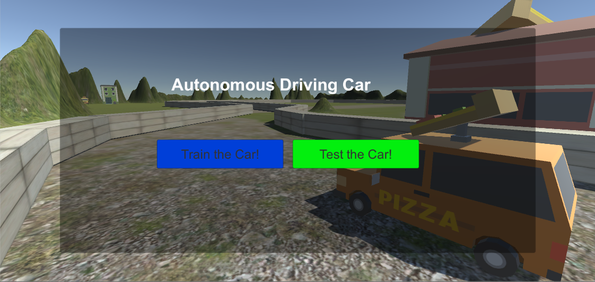
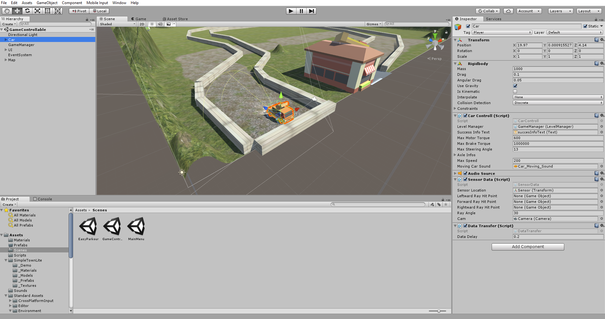
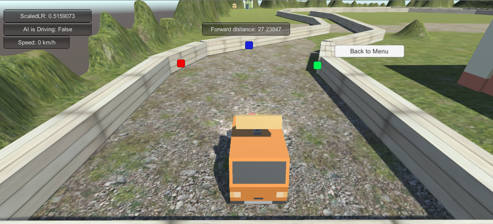

# SelfDrivinCarTobi
This is a small Unity Project. 
This Part was for learning some basic Unity Concepts and refreshing these concepts.

The second part of the Project was a Python Rest Server which should give the car commands if it drives in the 'autonomous mode'.
The Machine Learning Model  I tried first was a Naive Bayes Classifier, which classified if the car should Turn Left, TurnRight, ShouldAccelerate.
I will Implement a lot of other supervised learning methods and may if I have time also start a Reinforcement Learning approach on this application

## Getting Started
Just Clone the repository start the server with Python 3, after you downloaded the needed libraries.
If I am finished with the project I will create a requirements.txt file, which inlcudes all the modules for the project to make the installation easier with pip. <br>
<b> Introduction will follow </b> <br>
<br>
<b>How you use the application:</b> <br>
1.   First of all run the server.py script in the Server Directory 
  The server.py starts a server, which is collecting the data of the car in Unity.
  The server is running on localhost on the Port 80. It is a simple Rest Implementation, that accepts POST requests on 2 paths.</li> 
  <ul>
      <li>'/sendDrivingData': Rest response will be the command for the car in autonomous mode. The command will be predicted with
      a certain ML-Supervised Method (SVM, NaiveBayes, NNs,...) and send back to the car. </li>
      <li> '/getDrivingData': On this path the server receives the data from the car and saves it, in order to learn from it for the        predcition </li>
  </ul>
2.   After you run the server, start the Unity Project and open the MainMenu Scene.
  Click on Play and choose the Training Mode first. <br>
3.   After you have collected enough data, simply try out the autonomous mode and see how your car solves the autonomous driving task.


## Some Impressions
TODO: Add pictures here and maybe a video how the car is driving autonomously and how it works.


## Theory & Code Explanation <br>

### Unity Project
The Unity Project has 3 Scenes. I will describe the 2 important ones. <br>
The <b>MainMenu Scene</b> has 2 Buttons, which start the Game either in Training or Autonomous Mode.
<br>
Therefore they use the functions of the GameManager Object with the GameManagerScript.cs and set the 2 methods of the GameManagerScript as the onClick Methods.<br>

The GameCntrollable Scene is the actual Game with the Parcour and the predefined end of the track. Just try to reach the pizza store without crashing against a wall. <br>

First of all 2 Pictures of it, so you see, how this scene actually looks like:<br>
<ul> 
  <li> This is the View of the GameControllable Scene in Unity, you can see all GameObjects, and the Properties of the Car
    
  </li>
  <li> This is the View of the GameControllable Scene actually if you play it
     <br>
  </li>
 </ul>
 
 In the first picture you can already see the important Game Objects on the left side and what scripts are used by the Car GameObject.
 <br>
 
The Car Game Object contains 4 Scripts:
<ul>
  <li> The CarControll Script: enables the moovement of the car, interacts with the other scripts aswell and somehow defines the lifecycle and doings of the car (autonomousMode, CollisionHandling, Init InformationHandling, ...)
  </li>
  <li> The LevelManager Script in the CarControllScript Block is just the reference to the GameObject "GameManager" and called, when you fail or reach thedestination. (levelManager.showMenu())
  </li>
    <li> The SensorData Script: Uses the Sensor in the front of the car ("Radar"- measures distances to objects maybe half a meter over the ground). After the start of the Game this script enables the "Radar" with the checkDistancesMethod(float time). <br>
     ```
  
       while (!CarControll.isFinished)
        {
            yield return new WaitForSeconds(time);
            //Debug.Log("Time: " + Time.time);
            forwardDistance = CheckForwardSensorDistance();
            leftDistance = CheckLeftwardSensorDistance();
            rightDistance = CheckRightWardSensorDistance();
            leftRightRatio = calculateLeftRightRatio(leftDistance, rightDistance);
            //Debug.Log("LR-Ratio: " + leftRightRatio);
        }
     
     ``` 
  It will also create a InformationList (addInformationList()), that collects the data in a list and serializes the data and makes a JSON Object out of it, to send it to the server later. <br>
  In addition to that this script also shows the radar measure points and the distance on the GUI with the methods OnGUi() and 
  with this line of code in every checkDistanceMethod, the RadarMeasurePoint is visualized with a GUI Point:
         
         //Set Sensor GUI to the hitpoint
           leftwardRayHitPoint.transform.position = cam.WorldToScreenPoint(hit.point);
  </li>
  <li> The DataTransfer Script: has 3 "main" methods: <br> 
  1. SendDataToServer(): calls the serialzeList() metod from the SensorData Script and sends this JSON listto the Rest Server running on localhost:80. This is only used in the Training Mode, because you send the list with all collected Data. <br>
  2. GetDataFromServer():Called in Autonomous Mode after Level start. Sends a Rest POST to the server with the current scaledSpeed, scaledForward, scaledLeftRightRatio and starts the WaitForRequest() Coroutine, which waits for the response with the commands for the car. <br>
  3. WaitForRequest(): receives the response from getDataCall to the Server and sends the "commands" to the car as following:
 
            CarControll.isTurningLeft = float.Parse(dict["isTurningLeft"]);
            CarControll.isTurningRight = float.Parse(dict["isTurningRight"]);
            CarControll.isNotTurning = float.Parse(dict["isKeepingStraight"]);
            CarControll.isAccelerating = float.Parse(dict["isAccelerating"]);
  </li>
  </ul>
  
  <br>
  This was the improtant stuff to know about the Unity Project. 
  
  
  
  ### Server Project
  The Server currently runs with Python 2.7 for Naive Bayes, but on the next ML - Method,  I will change it to Python 3.6. <br>
  On the bottom in this file, I will always try to keep it up to date for which ML method you need which Python version. <br>
  
  ######The structure of the Server
  
  <ul>
  <li> Server.py: This is the file, which you need to execute in order to start the server. It will immediately create a LearningManager, which creates the ML-Model with the training-data with the file training_data.csv in the folder data_dump. If you like to change the training data, just replace this file with your training data. <br>
    The Server.py also defines the API routes. <br>
    <b>The SEND_DRIVING_DATA_ROUTE </b>, accepts data and saves it with the help of the PersistanceManager of the persisting.py module. After the retrieval of new data, it will recreate/retrain the ML-model. <br>
    <b> The GET_DRIVING_DATA_ROUTE </b> retrieves the actual driving infos of the car and sends back the commands to drive.
  </li>
  <li> Persisting.py: PersistanceManager, for saving the training data. </li>
  <li> Learning.py (Differs according to the ML-Method): Creates a ML-Model and trains it with the data, in order to predict the commands for the car. </li>

  

## License

This project is licensed under the MIT License - see the [LICENSE.md](LICENSE.md) file for details 


The Unity project (Car and C# part) is based on this project, I rebuilded there code and tried to understand it, in order to get a feeling for it.
https://github.com/MCKapur/SPCSAISelfDrivingCar.
